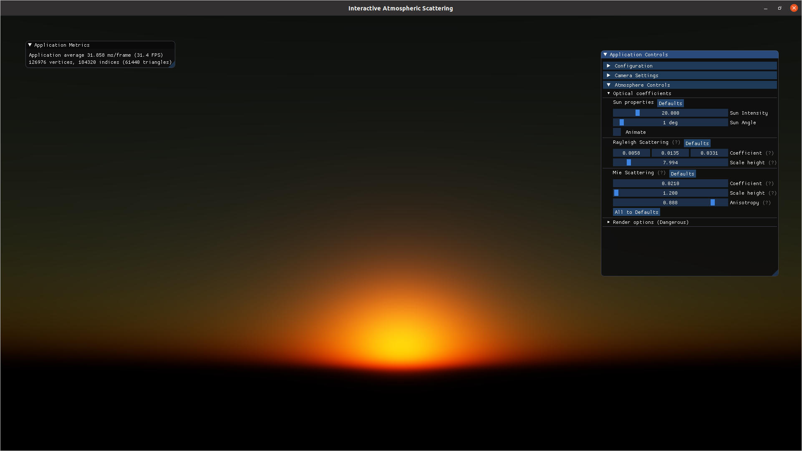
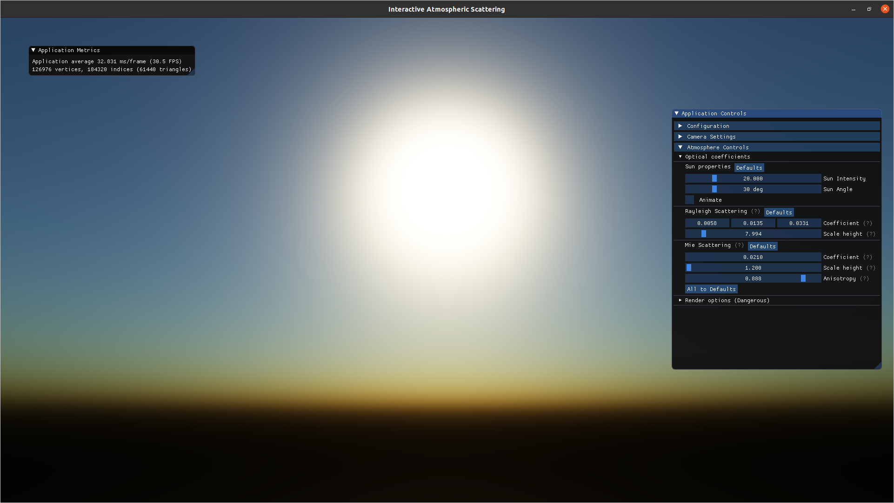
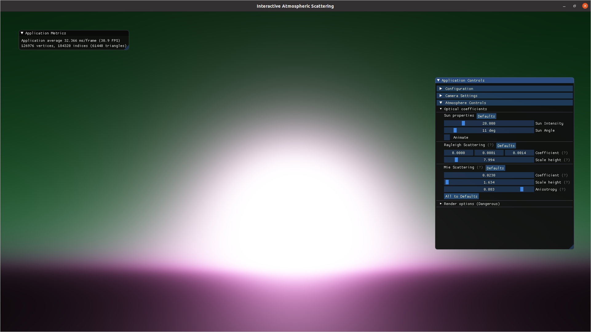
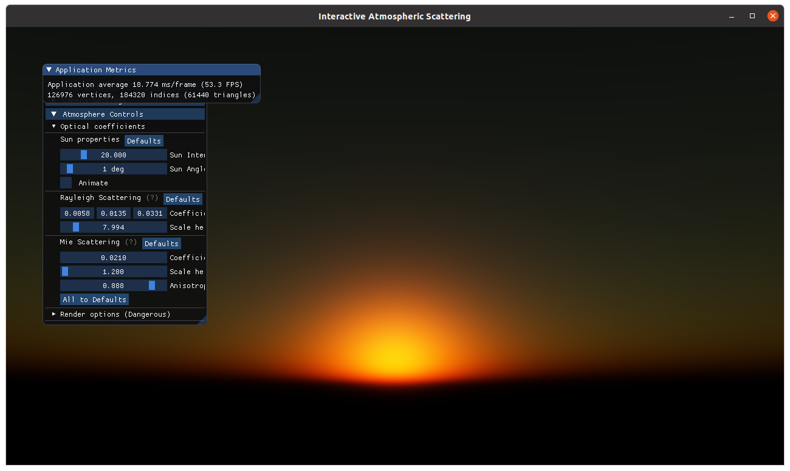

# Atmospheric Scattering in OpenGL
Atmospheric scattering written in C++ using OpenGL. Ray casting or rather ray-marching approach to compute the colors of the sky based on [Nishita's equations](https://dl.acm.org/doi/10.1145/166117.166140). For further explanation and used sources see the [documentation](doc/doc_CZ.pdf) (for now written in Czech, will be translated later).  
  
Example of output rendered using _Nvidia GeForce 940M_, at 30 FPS, 1080p resolution:

<p align="center">



</p>

## Features
* Real-time atmospheric scattering with adjustable number of samples
* Camera that allows free looking (pan & tilt) and free movement
* Intuitive GUI for responsive setting of the parameters of the atmosphere

## Requirements:
Tested on Ubuntu 20.04 x64 and Windows 10 x64.

* C++17 compiler
* CMake version 3.16 or higher
* OpenGL version 3.3 or higher

## Used Libraries:
* [GLFW3](https://www.glfw.org/)
* [GLAD](https://github.com/Dav1dde/glad)
* [GLM](https://github.com/g-truc/glm)
* [STB](https://github.com/nothings/stb)
* [ImGui](https://github.com/ocornut/imgui)
* [tinyobjloader](https://github.com/tinyobjloader/tinyobjloader)

## How to compile and run
On Linux systems:
```
$ mkdir build && cd build
$ cmake ..
$ make
$ ./demo
```

### Common issues
The application also creates a logfile `log.txt` in the current directory, see the file if any problems with the application occur, e.g., it exits unexpectedly.

#### Linux: CMake X11_Xxf86vm_LIB error
Probably need to install the following packages:
```
libxss-dev libxxf86vm-dev libxkbfile-dev libxv-dev
```
#### Far plane
Because the application tries to preserve realism when drawing the planet (resembling the Earth) and the atmosphere, it uses ratio 1 unit to 1 km. There might be a gray zone underneath the camera, adjusting distance of the `far plane` in `Camera settings` can reduce the size of the zone. 

#### Camera - gimball lock
The camera is implemented based on euler angles, when panning or tilting while looking straight up or down, the camera might lose a degree of freedom. For now restarting the application is the only way to fix the problem.  
  
First output:


## Controls
After the compiled binary is run a [window](images/01_after_init.png) is shown with dimensions 1280 x 720 by default. In the background the application renders the atmosphere for the currently set options. The options can be set using the UI presented in the foreground. On the first run, the two windows of the UI are set in some predefined location by ImGui, so it is preferable to drag them to the right and resize them, as shown in the images at the top. After closing the application, ImGui saves their locations for further runs.

Key bindings: 
* ESC - show/hide the UI, allows free movement of the camera,
* Right mouse click - while holding pan the camera,

Camera controls:
* Mouse movement - look with the camera,
* W, A, S, D - moves the camera in respective direction,
* SHIFT - camera speedup, when held with any key that is used to move the camera,

To control the looks of the atmoshpere use the inputs and sliders of the UI. For any further information look for `(?)` text that shows simple explanation when hovered over, or look up the [documentation](doc/doc_CZ.pdf) (in Czech, will be translated to English later).


### TODO
- save/load parameters to/from a file
- capture and save screenshot
- render ground with lighting and texture
- reset camera GUI option
- option to precalculate into texture
